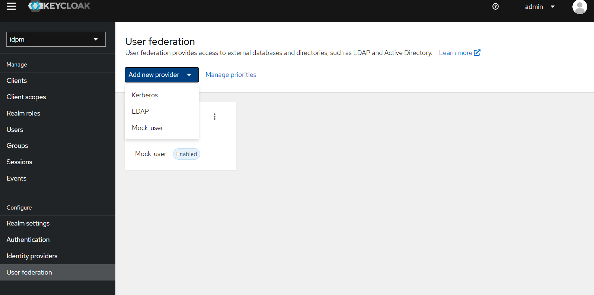
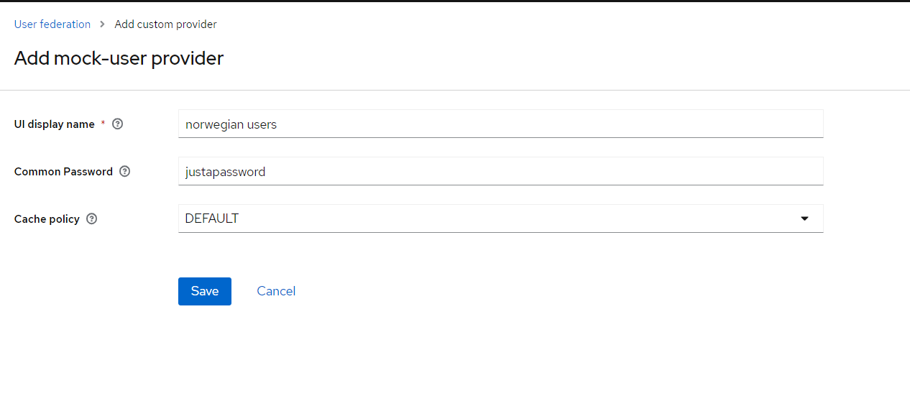

# configuring mock-user-provider 

When mock user provider is deployed to Keycloak, configure Keycloak to use `mock-user-provider` in authentication flows.  
User providers can be configured by selecting `User federation` from the left hand menu in Keycloak admin interface.  

Click `Add new provider` button and this displays a list of available providers,  
select `Mock-user` _(this is what this project provides)_ then follow steps.  

see scrnshots   
  
  
  
  

More information about custom providers can be found in  
[Keycloak docs](https://www.keycloak.org/docs/latest/server_admin/index.html#custom-providers)  

